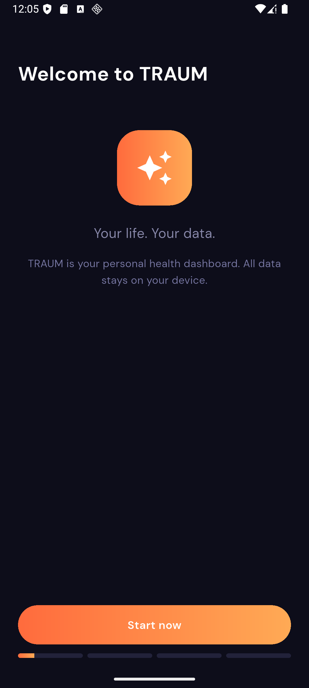
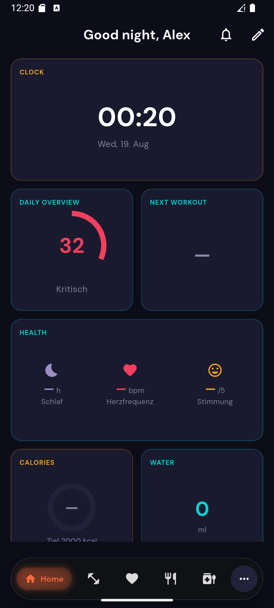
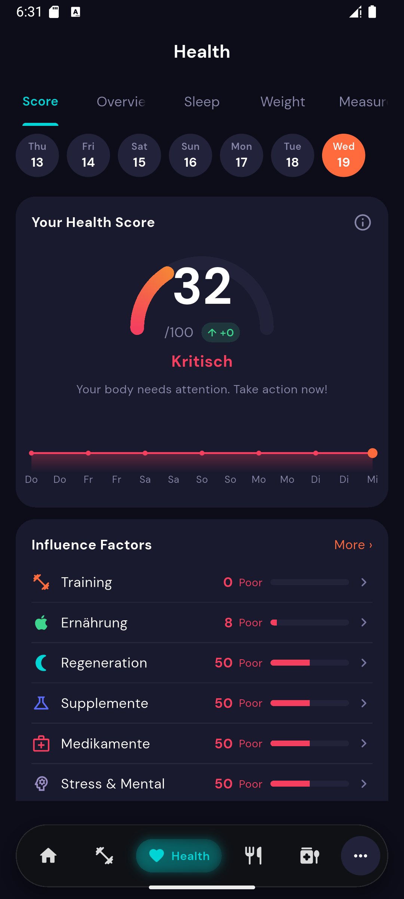
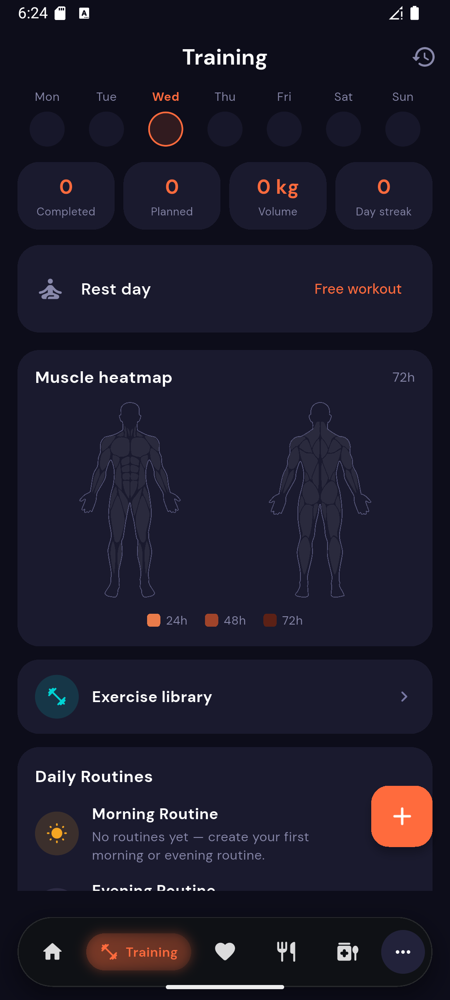
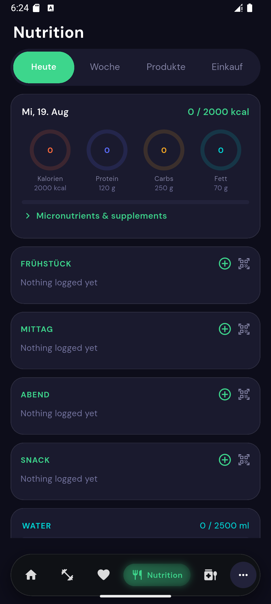
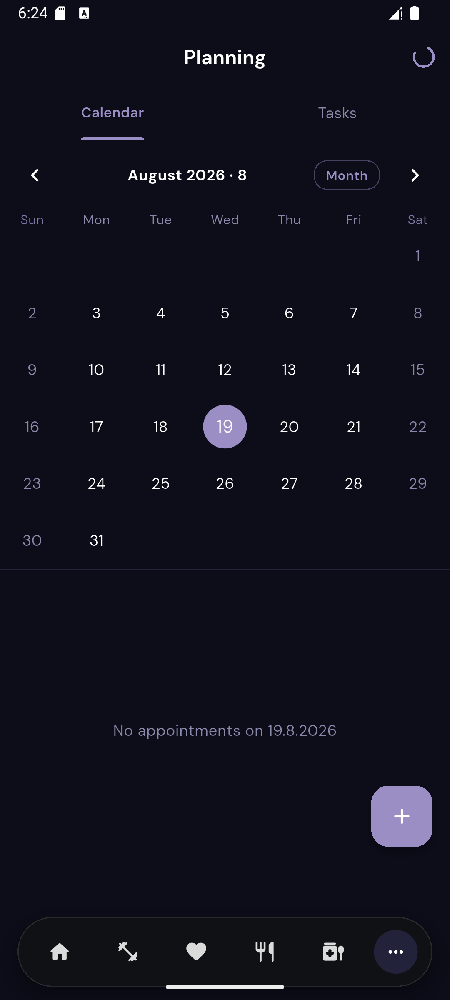
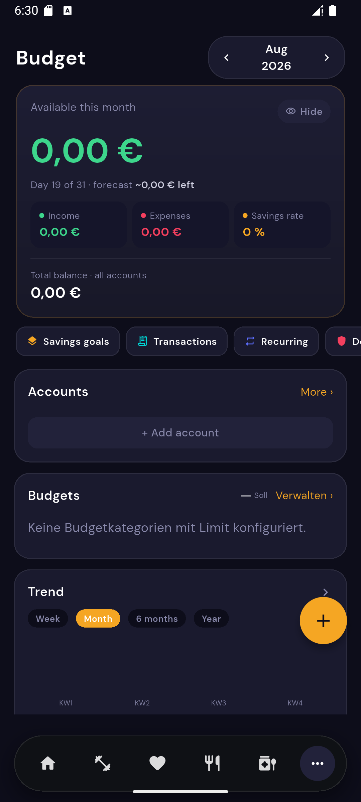
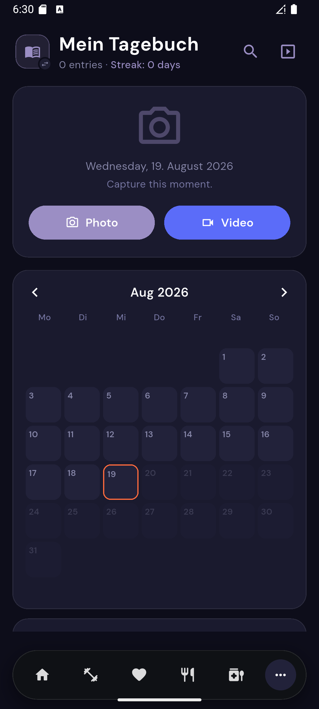
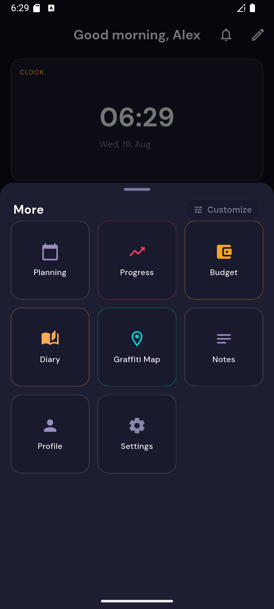

<div align="center">


# TRAUM

**Your life. Your data.**

One dashboard for training, nutrition, health, money, memories, and more —
built for Android, with a companion app for Windows & Linux, running 100% on your own device.

[](https://github.com/Lupus-atque-Corvus/Traum-APP/releases)


[](https://flutter.dev)
[](#license)

</div>

---

## What is TRAUM?

Most people track their life across half a dozen different apps — one for workouts, one for
calories, one for budgets, one for journaling, one for notes. TRAUM puts all of it in a single,
fast, fully offline app with a personal home screen you build yourself.

No account. No cloud sync. No ads. Every byte of data — your training log, your diary photos,
your bank balances — stays on your phone, in a local SQLite database you can export and back up
whenever you want.

<div align="center">



</div>

---

## Features

### 🏋️ Training
Log workouts against a plan (Push/Pull/Legs, full-body, upper/lower split, or your own), track
sets and volume, see which muscles are still recovering on a live heatmap, and browse an exercise
library with hundreds of bespoke illustrated icons.



### ❤️ Health Score
A single number (0–100) built from six weighted factors — training, nutrition, recovery,
supplements, medication, stress & mood — with a 7-day trend, a radar breakdown, and concrete
suggestions for what to improve next.

### 🍽️ Nutrition
Calorie and macro tracking with a barcode scanner, a searchable food database, meal templates,
water tracking, and a shopping-list mode for the grocery store.



### 💊 Substances
One place to log medication and supplement intake with per-item reminder schedules (down to
individual weekdays), plus a searchable reference database of thousands of substances for
looking things up.

### 🎯 Planning
Appointments and to-dos on a real calendar, with two-way OS calendar sync.



### 💰 Budget
Accounts, categorized transactions, recurring bills, savings goals, and debt tracking with
per-item breakdowns — plus a running "available this month" balance that carries over, not a
number that resets every 1st of the month.



### 📔 Diary
A daily photo/video journal with a live camera overlay that ghosts your last entry so every shot
lines up the same way over time, a calendar/heatmap view of your history, and a slideshow to look
back on it.



### 📝 Notes
Markdown notes with backlinks, tags, a visual link graph, templates, and full-text search — a
lightweight personal wiki that lives next to everything else.

### 🗺️ Graffiti Map
A geo-tagged marker map for tracking spots you've found or want to visit, with custom fields,
photos, and an offline dataset of hundreds of thousands of pre-seeded points to explore.

### 🎗️ Abstinence & Habits
Live streaks since your start date, money and time saved, and daily habit check-ins — all
supporting multiple trackers at once.

### 🔔 Smart notifications
Every reminder — medication, training, habits, water, to-dos — is scheduled individually and
respects Android's exact-alarm and battery rules, so it actually fires.

### 🔐 Security
A custom PIN lock (with escalating lockouts after repeated failures) plus biometric unlock,
protecting a database that never leaves your device.

### 🏠 Home screen, your way
Pick which of the 19 modules matter to you, arrange the home dashboard with drag-and-drop tiles
in five sizes, and add native Android home-screen widgets for the ones you check the most.

<div align="center">

</div>

### 🌍 Two languages
Fully localized in **German** and **English**, switchable in-app.

### ⬆️ Auto-update
Checks GitHub Releases on launch and offers a one-tap in-app update — no Play Store needed.

---

## In progress / known limitations

TRAUM is actively developed, mostly through iterative real-device testing. Being upfront about
what's not finished yet:

- **Windows & Linux are "companion" builds, not full parity.** Core modules (budget, notes,
  diary, training log, planning, manual nutrition entry) work fully. Features with no desktop
  equivalent — Health Connect, Android home-screen widgets, calendar OS sync, the camera
  overlay, barcode/OCR scanning — are cleanly hidden rather than crashing. No sync between
  your phone and desktop installs yet; each has its own local database.
- **~46 dependencies** are still pinned below their latest major version (deliberately — several
  touch sensitive areas like notifications and are only bumped with a full device test afterward).
- **iOS home-screen widgets** exist in code but have never been built/tested (no Mac available).
- **Play Store signing** isn't wired up yet — releases are currently signed with a debug key,
  fine for direct APK installs, not yet ready for a Play Store listing.
- A handful of interactive tap targets haven't been audited against the 44dp minimum-size
  guideline yet.

See [`CHANGELOG.md`](CHANGELOG.md) for the detailed release history.

---

## Technical details

| | |
|---|---|
| Platform | Android, Windows, Linux (desktop builds are "companion" mode — see above) |
| Min. Android version | Android 8.0 (API 26) |
| Framework | Flutter |
| Database | SQLite (Drift ORM), fully local |
| State management | Riverpod |
| Navigation | GoRouter |

---

## Installation

Go to [Releases](https://github.com/Lupus-atque-Corvus/Traum-APP/releases) and download the
build for your platform:

### Android
- `traum-vX.Y.Z-arm64.apk` — for virtually every modern Android phone (64-bit ARM)
- `app-armeabi-v7a-release.apk` — for older 32-bit ARM devices
- `app-x86_64-release.apk` — for emulators / x86 devices

Allow installation from unknown sources in your Android settings, then open the downloaded APK.

### Windows
Download `traum-vX.Y.Z-windows-x64.zip`, unzip it anywhere, and run `traum.exe`.

### Linux
Download `traum-linux-x64.tar.gz`, extract it, and run the `traum` binary inside the `bundle`
folder. Requires GTK 3 (`libgtk-3-0`), present on virtually every desktop Linux distribution.

---

## Building from source

### Requirements

- Flutter SDK (>= 3.9.2)
- Android: Android Studio / Android SDK 26+
- Windows: Visual Studio 2022 with the "Desktop development with C++" workload
- Linux: `clang cmake ninja-build pkg-config libgtk-3-dev liblzma-dev libstdc++-13-dev
  libsecret-1-dev`

### Steps

```bash
git clone https://github.com/Lupus-atque-Corvus/Traum-APP.git
cd Traum-APP
flutter pub get

# Android
flutter build apk --release --split-per-abi   # → build/app/outputs/flutter-apk/

# Windows
flutter build windows                         # → build/windows/x64/runner/Release/

# Linux
flutter build linux                           # → build/linux/x64/release/bundle/
```

---

## License

Private project — all rights reserved.
