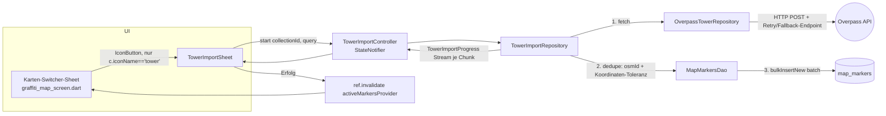

# Plan: OSM/Overpass-Import für "Türme" (Funkmasten) in die Graffiti-Map

## Context

Ziel: Funkmasten/Türme-Daten aus OpenStreetMap per Overpass API in die bestehende "Türme"-Kollektion
der Graffiti-Map importieren, damit der User nicht jeden Turm manuell anlegen muss. "Türme" ist keine
eigene Tabelle, sondern eine Zeile in `MapCollections` (`iconName == 'tower'`, verifiziert über
`MapTemplates.tuerme`); Punkte liegen in der gemeinsamen `MapMarkers`-Tabelle. Es gibt aktuell keine
externe ID/Dedupe-Spalte, keine Bulk-Insert-Methode und keine Feld-Definitionen für Türme
(`MapTemplates.tuerme.fields == []`).

Bestätigte Entscheidung mit dem User: Der Bulk-Import unterstützt zwei Modi — aktueller Kartenausschnitt
(Bbox) und eine echte Region/Land-Suche per Namen (Overpass `area[name=...]`), nicht nur Kartenausschnitt-
Vergrößern.

**Korrekturen gegenüber dem ursprünglichen Entwurf, verifiziert durch Code-Lektüre:**
- `schemaVersion` ist bereits **23** (nicht 22 — die zuletzt gemergte Substances-Migration hat sie schon
  erhöht). Die neue Migration ist also `if (from < 24)`, `schemaVersion => 24`.
- `MapTemplate.buildFieldConfig()` gibt bereits einen **JSON-String** zurück (`jsonEncode({...})` intern).
  Der Entwurf hätte `jsonEncode(...buildFieldConfig())` geschrieben — das wäre Doppel-Encoding gewesen.
- Blindes `UPDATE map_collections SET field_config = ... WHERE icon_name = 'tower'` würde vom User über
  die bestehende "Feld hinzufügen"-UI (`mapAddCustomField`) bereits selbst hinzugefügte Custom-Felder an
  der Türme-Collection überschreiben. Migration muss decode → merge (nur fehlende Keys ergänzen) → encode
  statt Overwrite.
- `open_food_facts_source.dart` liegt unter `lib/features/nutrition/food_api/`, nicht
  `lib/data/repositories/`.
- Die Ziel-`ListTile` für den Import-Trigger hat bereits eine `c.id`, sodass keine zusätzliche
  "Collection nach iconName finden"-DAO-Methode nötig ist.
- `http: ^1.2.2` ist bereits Dependency — keine pubspec-Änderung nötig.

---

## Ablauf



---

## Phase 1 — Schema-Migration (schemaVersion 23 → 24) — ⚠️ TEILWEISE ERLEDIGT, siehe Statushinweis unten

**`lib/data/database/tables/graffiti_map_tables.dart`**: `MapMarkers` bekommt
```dart
TextColumn get osmId => text().nullable()();
```
(OSM-Node-IDs als `"node/<id>"`-String, nicht `int` — vermeidet Verwechslung mit interner `MapMarkers.id`.)

**`lib/data/database/traum_database.dart`**: `schemaVersion => 24`, neuer Block nach `if (from < 23)`:
```dart
if (from < 24) {
  await migrator.addColumn(mapMarkers, mapMarkers.osmId);
  await customStatement(
    'CREATE UNIQUE INDEX IF NOT EXISTS idx_map_markers_osm_id '
    'ON map_markers (osm_id) WHERE osm_id IS NOT NULL',
  );

  // Bestehende Türme-Collections (aus MapCollectionSeeder, fields: [] zum Seed-Zeitpunkt)
  // bekommen die 3 neuen Tower-Felder nachträglich in field_config gemerged — NICHT überschrieben,
  // damit vom User über "Feld hinzufügen" selbst ergänzte Custom-Felder erhalten bleiben.
  // Die Feld-JSONs sind hier bewusst als Literal dupliziert (nicht aus PredefinedFields importiert):
  // Migrationen bleiben unabhängig von künftigen Änderungen an Feature-Code.
  const newTowerFields = [
    {
      'key': 'towerType', 'label': 'Turmtyp', 'type': 'select', 'iconName': 'cell_tower',
      'options': [
        {'value': 'Funkmast', 'colorHex': '00D4D4'},
        {'value': 'Sendemast', 'colorHex': '5B6CF9'},
        {'value': 'Sonstige', 'colorHex': '8888AA'},
      ],
    },
    {'key': 'towerHeight', 'label': 'Höhe (m)', 'type': 'text', 'iconName': 'height', 'options': []},
    {'key': 'towerOperator', 'label': 'Betreiber', 'type': 'text', 'iconName': 'business', 'options': []},
  ];
  final rows = await customSelect(
    "SELECT id, field_config FROM map_collections WHERE icon_name = 'tower'",
  ).get();
  for (final row in rows) {
    final id = row.read<int>('id');
    final cfg = jsonDecode(row.read<String>('field_config')) as Map<String, dynamic>;
    final fields = (cfg['fields'] as List).cast<Map<String, dynamic>>();
    final existingKeys = fields.map((f) => f['key']).toSet();
    for (final f in newTowerFields) {
      if (!existingKeys.contains(f['key'])) fields.add(f);
    }
    cfg['fields'] = fields;
    await customStatement(
      'UPDATE map_collections SET field_config = ? WHERE id = ?',
      [jsonEncode(cfg), id],
    );
  }
}
```
`dart:convert` ist in `traum_database.dart` ggf. neu zu importieren (prüfen, ob schon vorhanden).

Partial Unique Index (`WHERE osm_id IS NOT NULL`) betrifft nur importierte Marker — manuell angelegte
Türme ohne `osmId` bleiben unangetastet.

Danach: `dart run build_runner build --delete-conflicting-outputs`.

---

## Phase 2 — Feld-Definitionen für Türme (bestehendes Field-Chip-System, keine Parallelstruktur)

**`lib/features/graffiti_map/field_system/predefined_fields.dart`**: drei neue `MapField`-Consts nach
dem Muster von `condition`/`access` (siehe Datei, Zeile 6-54) — Werte identisch zu den Migrations-Literalen
oben, damit Neuinstallationen (via `MapCollectionSeeder` → `MapTemplates.tuerme.fields`) und migrierte
Bestandsinstallationen (via Phase 1) dieselben Felder bekommen:
```dart
static const towerType = MapField(
  key: 'towerType', label: 'Turmtyp', type: MapFieldType.select, iconName: 'cell_tower',
  options: [
    MapFieldOption(value: 'Funkmast', colorHex: '00D4D4'),
    MapFieldOption(value: 'Sendemast', colorHex: '5B6CF9'),
    MapFieldOption(value: 'Sonstige', colorHex: '8888AA'),
  ],
);
static const towerHeight = MapField(key: 'towerHeight', label: 'Höhe (m)', type: MapFieldType.text, iconName: 'height');
static const towerOperator = MapField(key: 'towerOperator', label: 'Betreiber', type: MapFieldType.text, iconName: 'business');
```
`all`-Liste um die drei ergänzen.

**`lib/features/graffiti_map/field_system/map_templates.dart`**: `MapTemplates.tuerme.fields: []` →
`[PredefinedFields.towerType, PredefinedFields.towerHeight, PredefinedFields.towerOperator]`.

**`lib/features/graffiti_map/map_visuals.dart`**: `mapFieldIcon`-switch (Zeile ~30-37) um
`'cell_tower' => Icons.cell_tower_outlined`, `'height' => Icons.height`,
`'business' => Icons.business_outlined` erweitern.

Diese Felder erscheinen automatisch als Chips in der Marker-Detailansicht (bestehender Feld-Chip-
Mechanismus) — keine neue UI-Komponente nötig.

---

## Phase 3 — `OverpassTowerRepository` (Query, Fetch, Parse)

**Neu: `lib/data/repositories/overpass_tower_repository.dart`** (Ordner konsistent mit
`map_collection_seeder.dart`, der ebenfalls dort liegt).

Resilienz-Pattern gespiegelt von `lib/features/nutrition/food_api/open_food_facts_source.dart`
(bis zu 2 Versuche, 600ms Delay, 8s Timeout, expliziter User-Agent, `debugPrint` bei Fehler) — erweitert
um eine zweite Ebene: Fallback-Endpoint bei wiederholtem Fehlschlag des primären. **Bewusste Abweichung**
vom `FoodSource`-Vertrag (der bei Netzwerkfehlern still `[]` zurückgibt): Der Tower-Import ist eine
explizite, einmalige Nutzeraktion mit sichtbarem Fortschritt/Fehlerstatus — hier soll ein Fehler den User
sichtbar erreichen, also wirft das Repository eine typisierte Exception statt still leer zurückzugeben.

```dart
sealed class OverpassAreaQuery {}
class OverpassBboxQuery extends OverpassAreaQuery {
  final double south, west, north, east;
  const OverpassBboxQuery({required this.south, required this.west, required this.north, required this.east});
}
class OverpassRegionQuery extends OverpassAreaQuery {
  final String name; // z.B. "Bayern", "Deutschland"
  const OverpassRegionQuery(this.name);
}

class OverpassTowerResult {
  final String osmId; // "node/<id>"
  final double latitude, longitude;
  final String? name, towerType, heightMeters, operatorName;
}

class OverpassImportException implements Exception {
  final String messageKey; // ARB-Key, im UI aufgelöst
  const OverpassImportException(this.messageKey);
}

class OverpassTowerRepository {
  static const _endpoints = [
    'https://overpass-api.de/api/interpreter',
    'https://overpass.kumi.systems/api/interpreter',
  ];

  Future<List<OverpassTowerResult>> fetchTowers(OverpassAreaQuery query) async { ... }
}

/// Reine, testbare Parse-Funktion, kein HTTP — Muster wie parseOffSearch().
List<OverpassTowerResult> parseOverpassResponse(Map<String, dynamic> json) { ... }
```

**Query-Aufbau:**
- **Bbox-Modus**: `node["man_made"="mast"]["tower:type"="communication"](S,W,N,E);` +
  `node["man_made"="tower"](S,W,N,E);` + `node["communication:mobile_phone"="yes"](S,W,N,E);`,
  `[timeout:25]`.
- **Region-Modus**: **eine** kombinierte Overpass-Query (nicht zwei sequenzielle HTTP-Calls — vermeidet
  doppelten Retry/Fallback-Code-Pfad):
  ```
  [out:json][timeout:60];
  area["name"="<Name>"]["boundary"="administrative"]->.searchArea;
  .searchArea out ids;
  (
    node(area.searchArea)["man_made"="mast"]["tower:type"="communication"];
    node(area.searchArea)["man_made"="tower"];
    node(area.searchArea)["communication:mobile_phone"="yes"];
  );
  out body;
  ```
  `parseOverpassResponse` unterscheidet: kein Area-Element in `elements` (Typ `area`) → Name nicht
  auflösbar → `OverpassImportException('mapImportErrorRegionNotFound')`; Area-Element vorhanden, aber
  keine `node`-Elemente → leeres, aber valides Ergebnis (keine Exception). Bei mehreren Area-Treffern
  wird der erste verwendet — bekannte, im Code kommentierte Einschränkung (Mehrdeutigkeit z.B. Stadt vs.
  Bundesland gleichen Namens wird nicht aufgelöst).

Nur `node[...]` (keine ways/relations) — deckt praktisch alle Sendemasten ab, vermeidet
`out center;`-Geometrie-Komplexität; im Code als bewusste Vereinfachung kommentiert.

**Test**: `test/data/repositories/overpass_tower_repository_test.dart` — `parseOverpassResponse` gegen
handgeschriebene Beispiel-JSONs (vollständige Tags, fehlende Tags, fehlendes lat/lon, non-node, Area
gefunden/nicht gefunden), keine echten Netzwerkaufrufe.

---

## Phase 4 — Dedupe + gestückelter Import

**DAO-Ergänzungen `lib/data/database/daos/map_markers_dao.dart`** (Methoden im Stil der bestehenden
`getByCollection`/`insert`):
```dart
Future<Set<String>> getOsmIds(int collectionId) => ...
    // select mapMarkers.osmId where collectionId equals & osmId not null, map to Set

Future<List<(double, double)>> getCoordinates(int collectionId) => ...
    // select latitude/longitude where collectionId equals & beide not null

Future<int> bulkInsertNew(List<MapMarkersCompanion> rows) =>
    batch((b) => b.insertAll(mapMarkers, rows)).then((_) => rows.length);
```
(`batch()` ist Standard-Drift-API, in dieser DAO-Schicht bisher ungenutzt aber nicht neu für das
Framework — nötig für performanten Bulk-Insert statt N Einzel-`insert()`-Aufrufen.)

**Neu: `lib/data/repositories/tower_import_repository.dart`** — `TowerImportRepository`
(injiziert `MapMarkersDao` + `OverpassTowerRepository`):
- `Stream<TowerImportProgress> importTowers({required int collectionId, required OverpassAreaQuery query})`
- Dedupe zweistufig: (1) `osmId`-Abgleich gegen `getOsmIds` — primärer Schlüssel, stabil über wiederholte
  Imports. (2) Koordinaten-Toleranz (~5m ≈ 0.000045°) gegen `getCoordinates` als Fallback — fängt
  Kollisionen mit Türmen, die der User **vor** diesem Feature manuell angelegt hat und die daher keine
  `osmId` haben.
- Chunking: Batches à ~200 Einträge, `bulkInsertNew` pro Chunk, `await Future.delayed(Duration.zero)`
  zwischen Chunks (kein Isolate — Projekt nutzt bisher nirgends `compute()`/`Isolate.spawn`; Chunking+Yield
  reicht für die erwartete Datenmenge einer Region).
  `TowerImportProgress {total, imported, skipped, errors}` wird nach jedem Chunk emittiert.
- Mapping OSM-Tag → `customFields`-JSON (`MapMarkers.customFields`, roher JSON-String, kein Drift-
  TypeConverter — manuell `jsonEncode`n): `tower:type=communication` → `towerType: 'Funkmast'` (einzige
  aus den abgefragten Tags klar ableitbare Ausprägung; `'Sendemast'` bleibt manuell editierbar — im Code
  kommentiert, keine falsche Präzision vortäuschen).

**Riverpod — Neu: `lib/features/graffiti_map/tower_import_controller.dart`**:
`overpassTowerRepositoryProvider`, `towerImportRepositoryProvider`, `TowerImportState`
(`running`, `progress`, `errorKey`, `done`), `TowerImportController extends StateNotifier<TowerImportState>`
mit `start({collectionId, query})`, `towerImportControllerProvider` (`autoDispose`). `graffiti_map_provider.dart`
importiert bereits `flutter_riverpod/legacy.dart` (für `StateProvider`) — `StateNotifierProvider` kommt aus
demselben Paket und ist im übrigen App-Code bereits an anderer Stelle verwendet (neu für diese eine Datei,
nicht neu für das Projekt).

**Test**: `test/data/repositories/tower_import_repository_test.dart` — In-Memory-DB
(`TraumDatabase.forTesting(NativeDatabase.memory())`), Türme-Collection + Bestandsmarker (einer mit
`osmId`, einer ohne, an bekannter Koordinate) seeden, `OverpassTowerRepository` durch Fake ersetzen,
Dedupe-Logik (osmId-Treffer übersprungen, Koordinaten-Treffer übersprungen, neue eingefügt inkl. korrekter
`customFields`) verifizieren.

---

## Phase 5 — UI: Import-Trigger + Bottom Sheet

**Trigger** — `lib/features/graffiti_map/graffiti_map_screen.dart`, `_showMapSwitcher` (Zeile 590-723):
im `trailing`-`Row` des Collection-`ListTile` (Zeile 659-675, neben dem bestehenden Edit-`IconButton`)
zusätzlicher `IconButton` (`Icons.cloud_download_outlined`), sichtbar nur wenn `c.iconName == 'tower'`.
`onPressed`: `Navigator.pop(ctx)` (schließt den Switcher — `ctx` ist der Sheet-Builder-Context) gefolgt
von `showModalBottomSheet(context: context, ...)` mit dem **äußeren** `context`-Parameter der Methode
(nicht `ctx`) — exakt das Muster, das der bestehende Edit-Button (Zeile 669-672) schon nutzt und das
laut CLAUDE.md-Handoff bereits als sicher verifiziert ist (der äußere Screen-Context bleibt gemountet,
nur das Sheet wird geschlossen).

**Neu: `lib/features/graffiti_map/tower_import_sheet.dart`** — `TowerImportSheet`
(`ConsumerStatefulWidget`, `showModalBottomSheet(isScrollControlled: true)`), Inhalt:
1. Modus-Auswahl (`RadioListTile`, ARB-Labels):
   - "Aktueller Kartenausschnitt" → `OverpassBboxQuery` aus `_mapController.camera.visibleBounds`, als
     Snapshot beim Öffnen des Sheets übergeben (keine live gehaltene Map-Referenz im Sheet).
   - "Region/Land" → Textfeld für Namen → `OverpassRegionQuery`.
2. "Import starten" → `ref.read(towerImportControllerProvider.notifier).start(...)`.
3. Während `state.running`: `LinearProgressIndicator` + Live-Zähler via ARB-Template `mapImportProgress`.
4. Bei `state.done`: Ergebnis-Zusammenfassung + "Fertig"-Button; bei `errorKey != null` entsprechende
   lokalisierte Fehlermeldung statt Fortschritt.
5. Nach Erfolg: `ref.invalidate(activeMarkersProvider)` (bestehendes, verifiziertes Muster — schon an
   `graffiti_map_screen.dart` Zeile 586-587 nach Marker-Anlage genutzt) — neue Marker erscheinen über
   denselben Rendering-/Tap-Pfad wie manuell angelegte, keine Code-Änderung dort nötig.

---

## Phase 6 — ARB-Keys (`app_de.arb` + `app_en.arb`, Konvention `map` + PascalCase — bestätigt durch
`mapDistanceFromYou`, `mapTemplateTowers`, `mapFieldCondition` etc.; NICHT die veraltete `graffitiMap*`-
Konvention aus älteren Einträgen)

`mapFieldTowerType`, `mapFieldTowerHeight`, `mapFieldTowerOperator`, `mapImportTowersTooltip`,
`mapImportTowersTitle`, `mapImportAreaViewport`, `mapImportAreaRegion`, `mapImportRegionHint`,
`mapImportStartButton`, `mapImportProgress` (ICU-Platzhalter `imported`/`skipped`/`errors`/`total`, Typ
`"int"` — anders als `mapDistanceFromYou`, dessen `distance`-Platzhalter Typ `"String"` ist, weil dort
bereits vorformatierter Text übergeben wird), `mapImportDone`, `mapImportCloseButton`,
`mapImportErrorNetwork`, `mapImportErrorHttp`, `mapImportErrorRegionNotFound`, `mapImportErrorUnknown`.
Danach `flutter gen-l10n`.

---

## Neue/geänderte Dateien

**Neu:**
- `lib/data/repositories/overpass_tower_repository.dart`
- `lib/data/repositories/tower_import_repository.dart`
- `lib/features/graffiti_map/tower_import_controller.dart`
- `lib/features/graffiti_map/tower_import_sheet.dart`
- `test/data/repositories/overpass_tower_repository_test.dart`
- `test/data/repositories/tower_import_repository_test.dart`

**Geändert:**
- `lib/data/database/tables/graffiti_map_tables.dart` (neue `osmId`-Spalte)
- `lib/data/database/traum_database.dart` (schemaVersion 24, Migration inkl. field_config-Merge)
- `lib/data/database/daos/map_markers_dao.dart` (`getOsmIds`, `getCoordinates`, `bulkInsertNew`)
- `lib/features/graffiti_map/field_system/predefined_fields.dart` (3 neue Felder)
- `lib/features/graffiti_map/field_system/map_templates.dart` (`tuerme.fields`)
- `lib/features/graffiti_map/map_visuals.dart` (3 neue Icon-Cases)
- `lib/features/graffiti_map/graffiti_map_screen.dart` (Import-Icon im Map-Switcher)
- `lib/l10n/app_de.arb`, `lib/l10n/app_en.arb`
- Generiert: `*.g.dart` (build_runner), `app_localizations*.dart` (gen-l10n)

**Migration: ja — schemaVersion 23 → 24** (neue nullable `osmId`-Spalte + partieller Unique-Index auf
`MapMarkers`, plus gemergter — nicht überschriebener — `field_config`-Rewrite der bestehenden
Türme-Collection(s)).

---

## Verifikation

1. `dart run build_runner build --delete-conflicting-outputs` — sauberer Regen, keine Konflikte.
2. `flutter gen-l10n` nach ARB-Änderungen.
3. `flutter analyze` → 0 Issues (insbesondere kein `withOpacity`, `child:` nicht als letztes Property).
4. `flutter test` → bestehende Suite grün + neue Repository-Tests grün.
5. Manueller In-App-Test (Ergebnis dem User im Abschluss mitteilen):
   - Bbox-Modus über einen kleinen, bekannten Kartenausschnitt (Stadtgebiet) ausführen, Fortschritt ohne
     UI-Ruckeln beobachten, Ergebnis-Zahl gegen DB prüfen.
   - Region-Modus mit einem bekannten, kleineren Namen testen (nicht gleich ganz Deutschland wegen
     Laufzeit/Datenmenge), inkl. einem absichtlich falschen Namen zur Prüfung von
     `mapImportErrorRegionNotFound`.
   - Einen importierten Marker antippen → normaler Detail-Flow, `towerType`/`towerHeight`/
     `towerOperator`-Chips sichtbar.
   - Import über denselben Bereich wiederholen → alle Ergebnisse als "übersprungen" (osmId-Dedupe
     funktioniert).
   - Bestehende, vor diesem Feature manuell angelegte Türme (ohne `osmId`) bleiben nach der Migration
     unverändert sichtbar, inkl. eventuell selbst hinzugefügter Custom-Felder in ihrer Collection.
6. Abschluss-Zusammenfassung für den User: geänderte/neue Dateien, Migration (Version 23→24), Anzahl real
   importierter Testdatensätze aus Schritt 5.

## Bekannte Einschränkungen (bewusst, im Code kommentiert)

- Region-Suche nutzt den ersten Treffer bei mehrdeutigen Namen (keine Auswahl-UI bei Kollisionen).
- Nur OSM-Nodes werden abgefragt (keine ways/relations mit Geometrie-Zentroid).
- `tower:type` wird nur grob auf "Funkmast" gemappt; "Sendemast" bleibt manuell editierbar.
- Sehr große Regionen (z.B. ganze Länder) können bei der öffentlichen Overpass-Instanz zu langen
  Laufzeiten oder Timeouts führen — kein serverseitiges Pagination-System, nur Timeout-Erhöhung (60s)
  und Mirror-Fallback.

---

## Status (Stand 2026-07-29)

Phase 1 ist **teilweise** im Code umgesetzt (Commit `d142963` auf Branch
`claude/refine-local-plan-l89s8i`): `osmId`-Spalte + Migration `if (from < 24)` sind geschrieben,
**aber `build_runner` wurde noch nicht ausgeführt** — die generierten Drift-Dateien (`*.g.dart`)
spiegeln die neue Spalte also noch nicht wider. Phasen 2–6 sind noch nicht begonnen.

Eine Folge-Session kann direkt auf Branch `claude/refine-local-plan-l89s8i` aufsetzen und mit
`dart run build_runner build --delete-conflicting-outputs` fortsetzen, dann Phase 2 beginnen.
